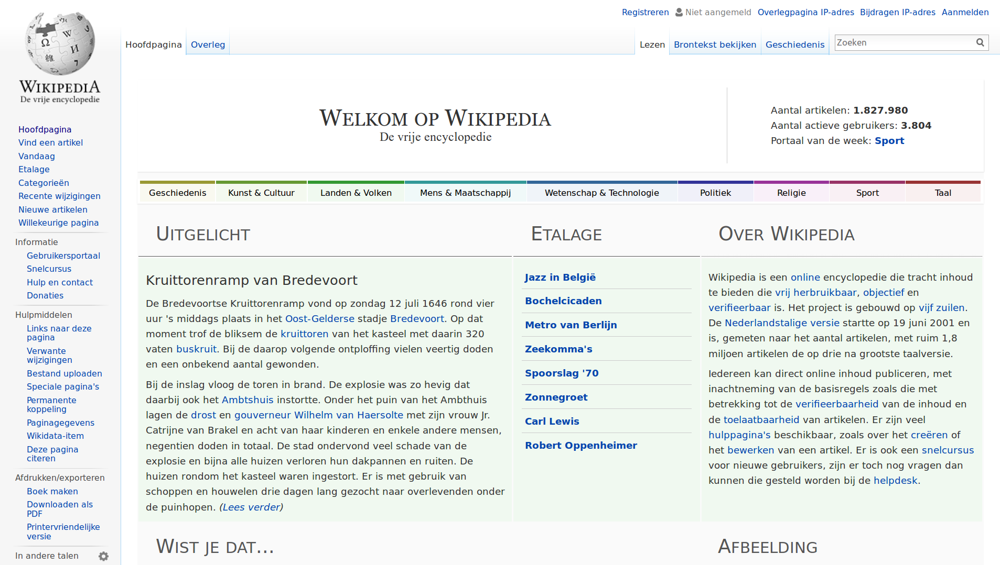

# Search Tool add-on for Firefox to seach Dutch Wikipedia

## Documentation

https://developer.mozilla.org/en-US/docs/Creating_MozSearch_plugins

https://developer.mozilla.org/en-US/Add-ons/Creating_OpenSearch_plugins_for_Firefox

https://nl.wikipedia.org/w/api.php?action=help&modules=opensearch

## Images

### PNG file W

The folling file was used for creating the icons. It was enlarged to 1280x1280, cropped to 1150x1150 and rescaled to 64x64 and 32x32 PNG and 16x16 ICO.

https://upload.wikimedia.org/wikipedia/commons/thumb/4/46/Wikipedia-W-visual-balanced.svg/1280px-Wikipedia-W-visual-balanced.svg.png

### PNG logo NL

The following file was used as screenshot for the add-on site.

https://nl.wikipedia.org/static/images/project-logos/nlwiki.png

### PNG start page NL

The following file was used as screenshot for the add-on site.

https://upload.wikimedia.org/wikipedia/commons/d/df/WikiPedia.png

### PNG homepage NL

The following file was used as screenshot for the add-on site.

wikipedia-nl-homepage.png

### ICO file W

The folling file was not used. (Was used for icon.)

https://nl.wikipedia.org/static/favicon/wikipedia.ico

### PNG logo

The folling file was not used. (Was used for site icon.)

https://upload.wikimedia.org/wikipedia/meta/0/08/Wikipedia-logo-v2_1x.png

